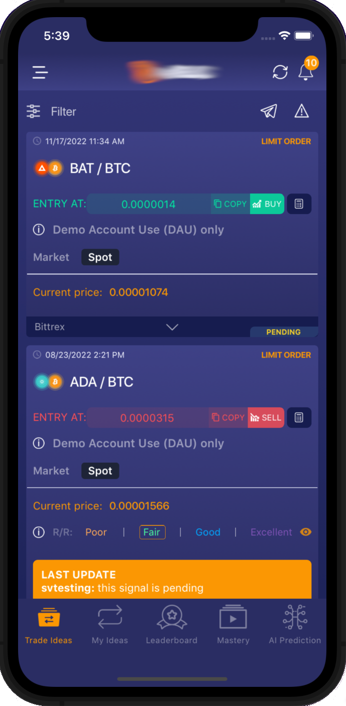
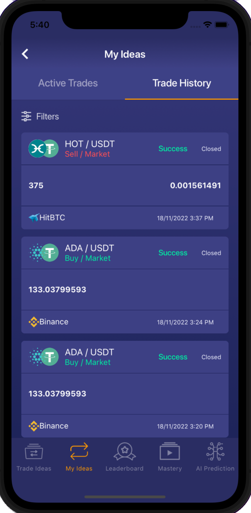
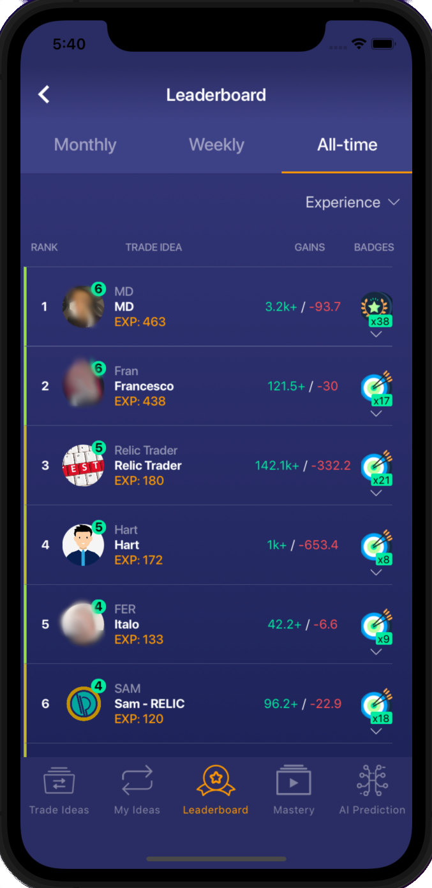
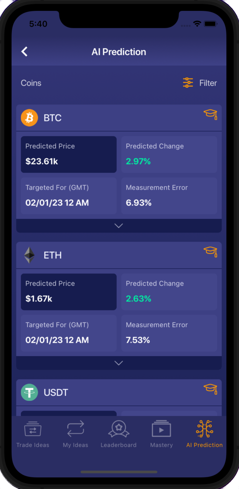
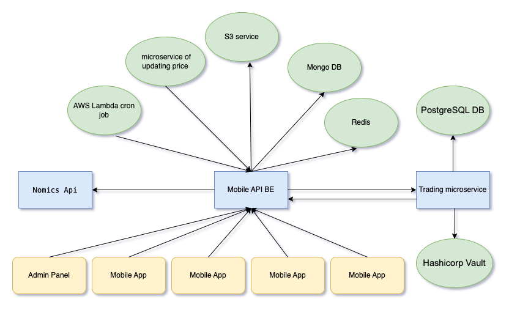
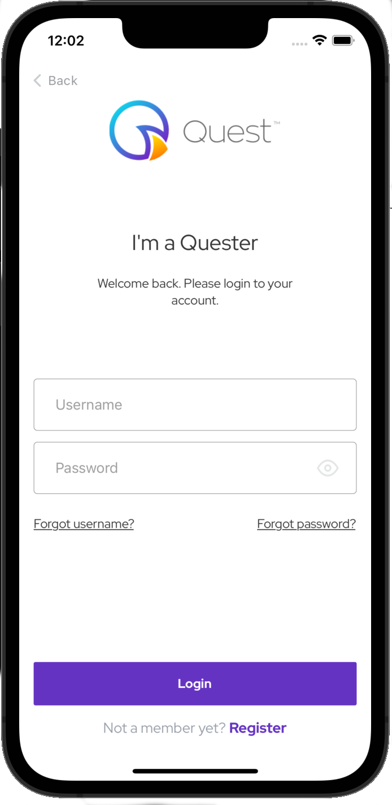
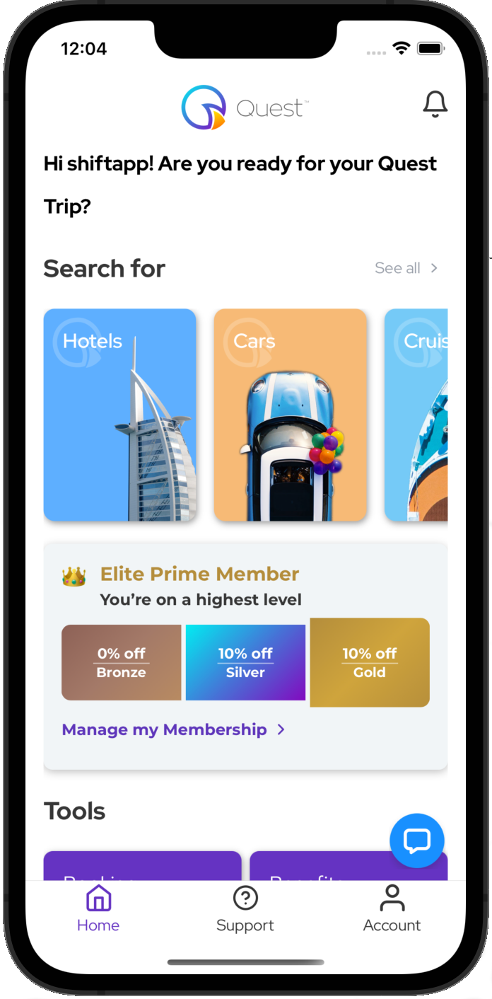
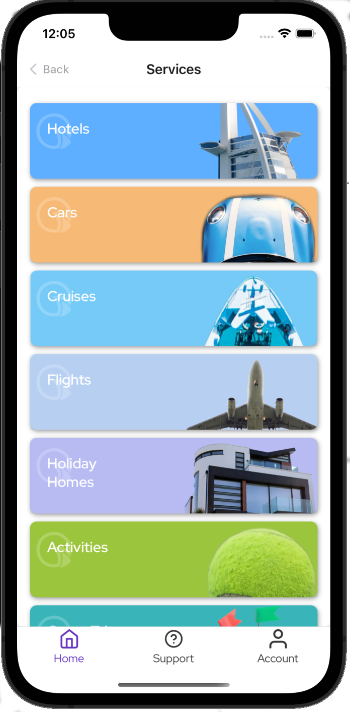
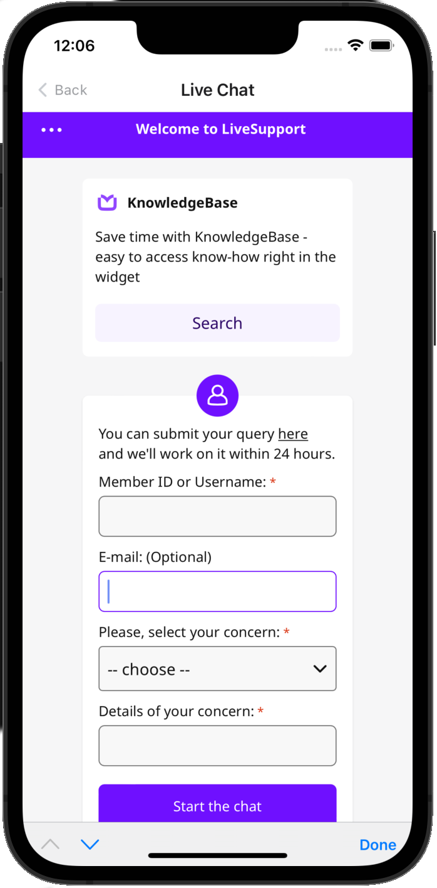

# portfolio

## Node.js, React Native Full-stack Engineer with 5+ years of  commercial experience. 

 - [Example of React Native Template](https://github.com/felexey777/React-native-example)
 - [Fork of SSE for Adonis.js](https://github.com/felexey777/adonis-sse)
 - [All my repositories are here](https://github.com/felexey777?tab=repositories)
 
 ## My last project
 

 ### "Trading" Mob app

  
  
  
  

 ### "Trading" Backend

  

 ## "Quest" Mob app
 

  
  
  
  

 ## "DG4" Mob app
 
 ## "Arcoin3D"  Mob app
 
 ## "KidsEducation"  Mob app

 ## "DoctorHealth"  Mob app
 
 ## "BallDetector"  Mob app
 
 ## "BacteriaDetector"  Mob app
 
 ## "Labarchives"  Mob app
 
 ## "PocketRadar"  Mob app
 
 ## "MVPCAST"  Mob app
 
 ## "Palms"  Mob app
 
 ## "Pawnshop"  Mob app
 
 
 
 
 

